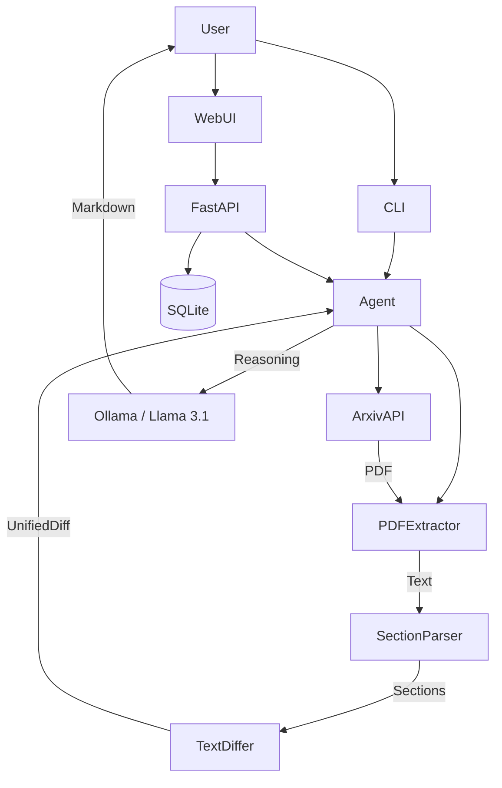

# arxiv-diff

> [!IMPORTANT]
> **Project Status: Incomplete (Work in Progress)**
> This project is currently in active development. While the core infrastructure (CLI, Web UI, API, Tools) is functional, the following items are still pending:
> - **LLM Optimization**: Tuning the local ReAct loop for Ollama models (currently slow on large papers).
> - **Notification Bots**: Discord and Twitter integration (currently stubs only).
> - **Enhanced Watcher**: Continuous background loop (currently manual/one-shot).
> - **Full Containerization**: Final testing of the Docker environment with local Ollama access.

**What changed in that paper?**

`arxiv-diff` is an AI-powered research agent that generates human-readable changelogs between distinct versions of arXiv papers. No more hunting for "v1 vs v2" differences manually—let local AI do the heavy lifting.

---

## Features

- **Agentic Analysis**: Uses local LLMs (via Ollama) to perform semantic diffing and significance analysis.
- **Smart Parsing**: Automatically identifies sections, figures, and tables.
- **CLI & Web Interface**: Feature-rich terminal tool and a clean, responsive web dashboard.
- **Paper Monitoring**: Watch specific papers for updates and receive automated alerts.
- **Persistent Storage**: Tracks paper history and cached reports in a local SQLite database.

## Getting Started

### Prerequisites

- Python 3.10+
- [Ollama](https://ollama.com/) installed and running.
- Local Models: `llama3.1:8b` (recommended) or `minimax-m2.5:cloud`.

### Installation

```bash
# Clone the repository
git clone https://github.com/dhruva137/arxiv-agent.git
cd arxiv-agent/arxiv-diff

# Install the package and dependencies
pip install .
pip install ollama

# Pull required models
ollama pull llama3.1:8b
```

### Configuration

The application uses a `.env` file for configuration. Copy the example and adjust as needed:

```bash
cp .env.example .env
```

Key settings in `arxiv_diff/config.py`:
- `ollama_model`: The model to use (default: `llama3.1:8b`).
- `ollama_host`: Your Ollama API endpoint (default: `http://localhost:11434`).

### Usage (CLI)

```bash
# Get version history for a paper
arxiv-diff versions 2305.18290

# Generate a comprehensive AI changelog
arxiv-diff diff 2305.18290

# View raw diff statistics quickly
arxiv-diff quick 2305.18290

# Add a paper to the watch list
arxiv-diff watch 2305.18290

# Launch the web interface
arxiv-diff serve
```

### Usage (Web)

After starting the server with `arxiv-diff serve`, access the dashboard at [http://localhost:8000](http://localhost:8000).

## Architecture



## Docker Deployment

The project includes a Docker configuration for easy deployment:

```bash
docker-compose up -d
```

## License

MIT
